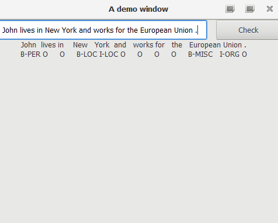
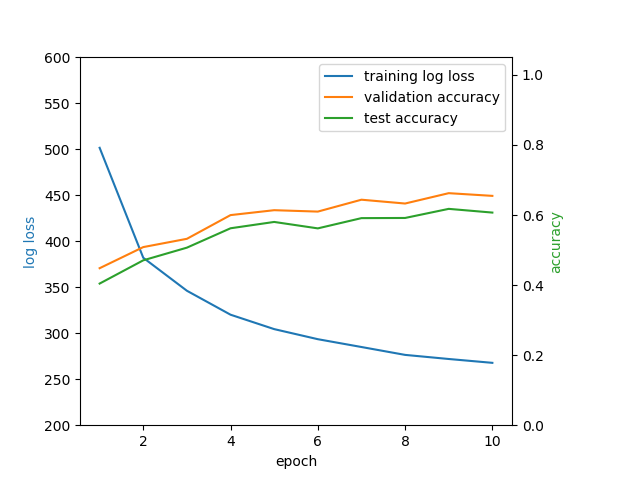
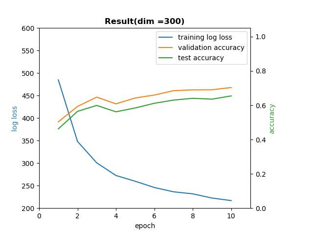

<a name="logo"/>
<div align="center">
<a href="https://julialang.org/" target="_blank">
</img>
</a>
</div>


[travis-img]: https://img.shields.io/travis/JuliaLang/julia/master.svg?label=Linux+/+macOS
[appveyor-img]: https://img.shields.io/appveyor/ci/JuliaLang/julia/master.svg?label=Windows
[coveralls-img]: https://img.shields.io/coveralls/github/JuliaLang/julia/master.svg?label=coveralls
[codecov-img]: https://img.shields.io/codecov/c/github/JuliaLang/julia/master.svg?label=codecov

# JuJu
This repo implements a NER model using Julia and Flux (glove + Bilstm + softmax);

Currently, we got chunk accuracy 78% on Conll2003 dataset.

## Dependency

Please see the REQUIRE file

## Task

Given a sentence, given a tag to each word (contain punctuation). The classic application is Named Entity Recognition. Here is an example.

```
John   lives in New   York
B-PER  O     O  B-LOC I-LOC
```

## Model

the code related to model generation

```julia
model = Chain(
    Dense_m(Weight),
    MyBiLSTM(EmbedSize, HiddenSize),
    Dropout(0.5),
    lower_dim(HiddenSize * 2),
    Dense(HiddenSize * 2, ClassNum),
    softmax
    )
```

1. an embedding layer to do word embedding, now we choose glove (Here we use the developing dataset to determine the hyperparameter embedding dim);
2. run a bi-lstm on each sentence to extract contextual representation of each word;
3. one dropout layer;
4. one fully connected layer to do the decode.
## Getting started

1. Download the initial data [(Conll2003 dataset)](https://www.clips.uantwerpen.be/conll2003/ner/)

or

```git
git clone https://github.com/GGchencan/JuJu.git
```

we put the inital Conll2003 data in our demo folder

2. use the data preprocess program to preprocess the data

```julia
julia data_preprocess_custom.jl train.txt test.txt dev.txt
```

this function will help you to build the dataset into six different data file, used for train, eval and test. The order of the parameters is the path to train data, test data and evaluation data.

3. cd the main.jl, simply run the file

```julia
julia main.jl
```

wait for several minutes, the train process will be finished.

4. make sure the generated model file exist in the JuJu folder, run the demo.jl to show the result of your training.

```julia
julia demo/demo.jl
```

the result is expected to like 



## Prepare your own data

The training data must be identical in the Conll2003 data format.

A default data example

```
John B-PER
lives O
in O
New B-LOC
York I-LOC
. O

This O
is O
another O
sentence
```

After your prepare your own data and seperate it as train, test, eval, use step2 in Getting started to process your own data and do the training.

## Results
The result shows as following:

1.example1 epoch = 10, dim(dimension of word embedding) = 50


2.example2 epoch = 10, dim(dimension of word embedding) = 300

